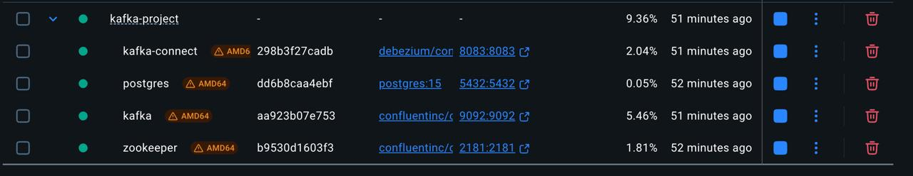
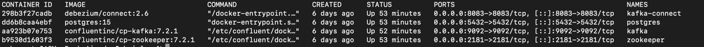

# 🔄 Data Streaming with Kafka: MySQL → Debezium → Kafka → Python → CSV

Este proyecto implementa un pipeline de datos en tiempo real utilizando tecnologías modernas de captura de cambios (CDC) para extraer y almacenar datos actualizados desde una base de datos PostgressSQL hacia archivos CSV (enviados y transformados en Python) para posterior análisis o integración.

---

## 📌 Objetivo

Diseñar un flujo de procesamiento en tiempo real que:
- Detecte cambios en una tabla de PostgressSQL (inserts, updates, deletes)
- Capture esos eventos utilizando el conector de Debezium
- Transmita los eventos a través del topico definido en Apache Kafka
- Consuma los datos con Python
- Almacene los resultados en un archivo `CSV` con formato estructurado

---

## 🧱 Arquitectura general

```plaintext
   +---------------+       +-------------+       +--------+       +--------+       +-----------+
   | PostgressSQL  | <---> | Debezium    | <---> | Kafka  | <---> | Python | --->  | CSV final |
   +---------------+       +-------------+       +--------+       +--------+       +-----------+
       Fuente.              CDC Connector        Mensajería       Consumidor        Almacenamiento
```


## ⚙️ Tecnologías utilizadas


### GIT: Sistema de versionado para utilizar este repositorio
  - 📦 Descargar e instalar la version de GIT desde Mac:
```bash
     brew install git
```
  - 📦 Descargar e instalar la version de GIT desde Windows: https://git-scm.com/download/win 
  - Para comprobar la version de PostgressSQL y que este instalado:
```bash
     git --version
```


### Docker: Orquestación de contenedores
  - 📦 Descargar Docker Desktop (Windows/Mac):https://www.docker.com/products/docker-desktop/
  - Para comprobar la version de docker y que este instalado:

```bash
     docker --version
     docker compose version
```

### MySQL: Base de datos origen
  - 📦 Descargar e instalar la version de PSQL (PostgressSQL) desde Mac:
```bash
     brew install libpq
     brew link --force libpq
```
  - Para comprobar la version de PostgressSQL y que este instalado:
```bash
     psql --version
```

### Python (utilizando las libs: confluent-kafka, pandas, tabulate): consumidor de eventos provenientes del Kafka y almacenamiento en CSV
  - 📦 Descargar e instalar Python desde Mac:
```bash
     brew install python
     brew install pip3
```
  - Para comprobar la version de Python y que este instalado:
```bash
     python --version
```

### Shell y jq: Para debug y parseo de eventos por medio de la terminal
  - 📦 Descargar e instalar JQ desde Mac para usar con la terminal:
```bash
     brew install jq
```

### Debezium: Conector que permite la captura de datos en tiempo real (CDC) => Servicio levantado por Docker
### Apache Kafka: Cola de eventos distribuida => Servicio levantado por Docker
### Kafka Connect: Framework para conectar Debezium a Kafka => Servicio levantado por Docker


## 1️⃣ Paso 1: Clonar el repositorio con los archivos

- Debemos clonar el repositorio una vez que estemos en nuestra carpeta local deseada para guardar el mismo:
```bash
     git clone https://github.com/gabycosta04/Kafka-Project
```

## 1️⃣ Paso 2: Levantar los servicios a utilizar en Docker

- Una vez tengamos todo instalado y el proyecto clonado en nuestra carpeta deseada, debemos ejecutar la terminal ubicados en esa carpeta y ejecutar el siguiente comando para levantar los archivos
```bash
     docker-compose up -d
```

- Para validar que los servicios esten levantados, podemos realizarlos de 2 formas:
  - Desde Docker Desktop, donde deberiamos ver algo del siguiente estilo:
  

  - Desde la Terminal ejecutando el siguiente comando, donde a partir del mismo deberiamos ver algo asi:
```bash
     docker ps
```
  
