# 🔄 Data Streaming with Kafka: MySQL → Debezium → Kafka → Python → CSV

Este proyecto implementa un pipeline de datos en tiempo real utilizando tecnologías modernas de captura de cambios (CDC) para extraer y almacenar datos actualizados desde una base de datos PostgressSQL hacia archivos CSV (enviados y transformados en Python) para posterior análisis o integración.

---

## 📌 Objetivo

Diseñar un flujo de procesamiento en tiempo real que:
- Detecte cambios en una tabla de PostgressSQL (inserts, updates, deletes)
- Capture esos eventos utilizando el conector de Debezium
- Transmita los eventos a través del topico definido en Apache Kafka
- Consuma los datos con Python
- Almacene los resultados en un archivo `CSV` con formato estructurado

---

## 🧱 Arquitectura general

```plaintext
   +---------------+       +-------------+       +--------+       +--------+       +-----------+
   | PostgressSQL  | <---> | Debezium    | <---> | Kafka  | <---> | Python | --->  | CSV final |
   +---------------+       +-------------+       +--------+       +--------+       +-----------+
       Fuente.              CDC Connector        Mensajería       Consumidor        Almacenamiento
```


---

## ⚙️ Tecnologías utilizadas


### GIT: Sistema de versionado para utilizar este repositorio
  - 📦 Descargar e instalar la version de GIT desde Mac:
```bash
     brew install git
```
  - 📦 Descargar e instalar la version de GIT desde Windows: https://git-scm.com/download/win 
  - Para comprobar la version de PostgressSQL y que este instalado:
```bash
     git --version
```


### Docker: Orquestación de contenedores
  - 📦 Descargar Docker Desktop (Windows/Mac):https://www.docker.com/products/docker-desktop/
  - Para comprobar la version de docker y que este instalado:

```bash
     docker --version
     docker compose version
```

### Postman: Aplicacion que permite probar APIs
  - 📦 Descargar Postman (Windows/Mac):hhttps://www.postman.com/downloads/


### MySQL: Base de datos origen
  - 📦 Descargar e instalar la version de PSQL (PostgressSQL) desde Mac:
```bash
     brew install libpq
     brew link --force libpq
```
  - Para comprobar la version de PostgressSQL y que este instalado:
```bash
     psql --version
```

### Python (utilizando las libs: confluent-kafka, pandas, tabulate): consumidor de eventos provenientes del Kafka y almacenamiento en CSV
  - 📦 Descargar e instalar Python desde Mac:
```bash
     brew install python
     brew install pip3
```
  - Para comprobar la version de Python y que este instalado:
```bash
     python --version
```

### Shell y jq: Para debug y parseo de eventos por medio de la terminal
  - 📦 Descargar e instalar JQ desde Mac para usar con la terminal:
```bash
     brew install jq
```

### Debezium: Conector que permite la captura de datos en tiempo real (CDC) => Servicio levantado por Docker
### Apache Kafka: Cola de eventos distribuida => Servicio levantado por Docker
### Kafka Connect: Framework para conectar Debezium a Kafka => Servicio levantado por Docker


---

## 1️⃣ Paso 1: Clonar el repositorio con los archivos

- Debemos clonar el repositorio una vez que estemos en nuestra carpeta local deseada para guardar el mismo:
```bash
     git clone https://github.com/gabycosta04/Kafka-Project
```


---


## 2️⃣ Paso 2: Levantar los servicios a utilizar en Docker

- Una vez tengamos todo instalado y el proyecto clonado en nuestra carpeta deseada, debemos ejecutar la terminal ubicados en esa carpeta y ejecutar el siguiente comando para levantar los archivos
```bash
     docker-compose up -d
```

- Para validar que los servicios esten levantados, podemos realizarlos de 2 formas:
  - Desde Docker Desktop, donde deberiamos ver algo del siguiente estilo:
  

  - Desde la Terminal ejecutando el siguiente comando, donde a partir del mismo deberiamos ver algo asi:
```bash
     docker ps
```
  

---

## 3️⃣ Paso 3: Crear tabla y datos en BD Origen.
- El siguiente paso es conectarnos a nuestra base de datos y tirar consultas, para eso podemos hacerlo de dos formas...
  - Desde la bash, debemos tirar el comando, donde te pedira que ingreses la contraseña:
    ```bash
        psql -h localhost -U postgres -d testdb
    ```
    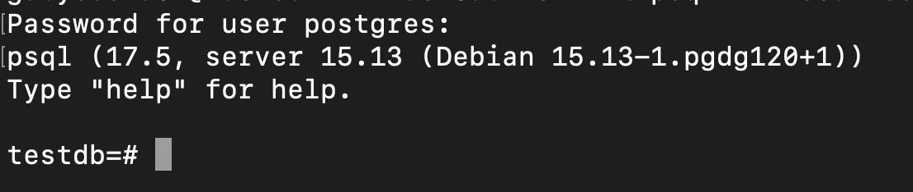

  - Desde el pgAdmin o algun motor de base de datos para tirar querys:
    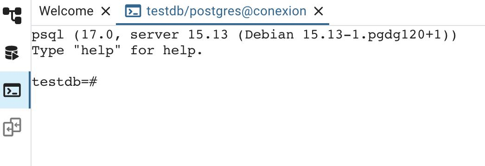

- Luego el proximo paso, una vez conectados es tirar la query para crear la tabla clientes y crear, modificar o eliminar registros a como gusten ....
  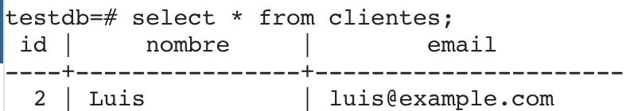

- Algo importante antes de avanzar, es importante ver que el wal_level tenga valor LOGICAL, con el comando:
  ```bash
      SHOW WAL_LEVEL
  ```
  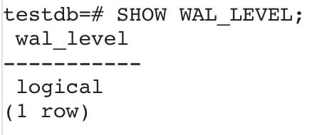

---

## 4️⃣ Paso 4: Realizar conexion de Debezium a BD Origen
- Luego que tengamos inicializado los clientes en nuestra base, debemos crear el conector de Debezium que permite realizar la captura de datos en tiempo real (CDC).

- Desde el POSTMAN, vamos a realizar lo siguiente:
  - Realizar conexion, que luego de ejecutar con tales parametros deberia verse como la siguiente imagen:
    - `Method`: `POST`  
    - `URL`: `http://localhost:8083/connectors`  
    - `Headers => Content-Type`: `application/json`  
    - `Body (raw)`: [Conexion realizada](debezium/postgres-connector.json)

    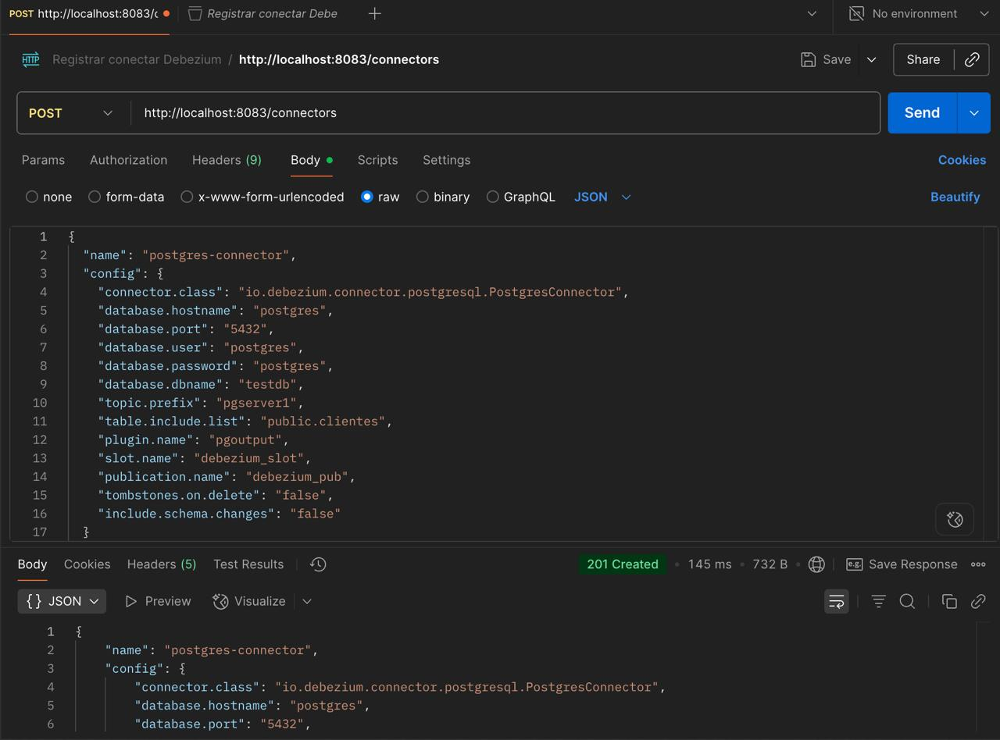

  - Verificar que el conector realmente se creo, que luego de ejecutar con tales parametros deberia verse como la siguiente imagen:
    - `Method`: `GET`  
    - `URL`: `http://localhost:8083/connectors`  
    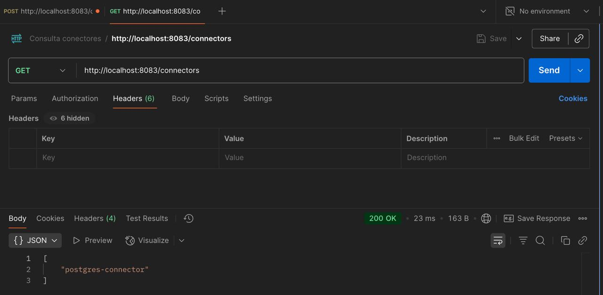

---

## 5️⃣ Paso 5: Ver el contenido de logs que contiene el TOPIC de Kafka
- Para poder ver los datos que se van creando, actualizando y borrando de la tabla CLIENTES en la cola de KAFKA, podriamos realizar lo siguiente desde la terminal:
  ```bash
    docker exec -i kafka kafka-console-consumer \
      --bootstrap-server localhost:9092 \
      --topic pgserver1.public.clientes \
      --from-beginning \
      --property print.value=true \
      --property print.key=false \
    | jq -r '
      .payload as $p |
      "🔹 \u001b[1;36mEVENTO ----------------------------\u001b[0m\n" +
      "🟩 AFTER:    \u001b[32m\($p.after | tostring)\u001b[0m\n" +
      "🟥 BEFORE:   \u001b[31m\($p.before | tostring)\u001b[0m\n" +
      "⚙️  OPERACIÓN: \u001b[33m\($p.op)\u001b[0m\n" +
      "⏱️  TIMESTAMP: \u001b[35m\($p.ts_ms)\u001b[0m\n"
    '
  ```
- Luego de ejecutarlo, deberiamos ver algo asi:
  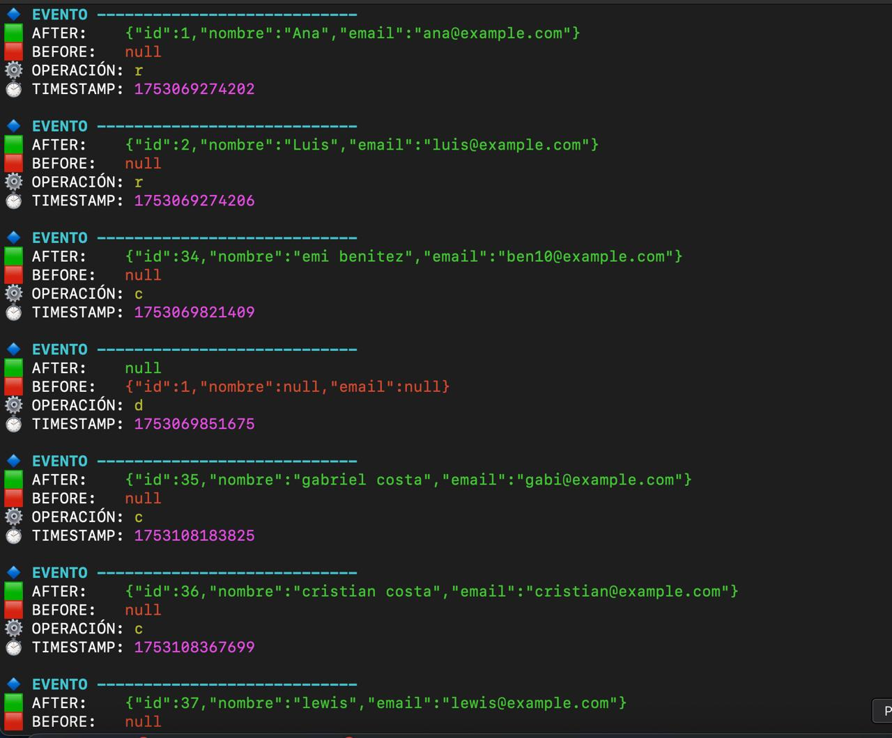


### 📄 Significado del campo `op` en eventos Debezium

```plaintext

| `op` | Significado                            | `before`            | `after`                                           |
|------|----------------------------------------|---------------------|---------------------------------------------------|
| `c`  | Create (INSERT)                        | `null`              | nuevo registro                                    |
| `u`  | Update                                 | registro anterior   | registro actualizado                              |
| `d`  | Delete                                 | registro borrado    | `null`                                            |
| `r`  | Read snapshot (lectura inicial)        | `null`              | registro existente cargado desde snapshot inicial |

```

---

## 6️⃣ Paso 6: Instalar libs de Python y ejecutar los Scripts de consumo de cola y Carga en destino final
- La idea es que tener ejecutando ambos procesos de Consumo de datos y Carga de datos en destino final para entender como va funcionando en real time la recarga...

- Primero, instalaremos las libs de Python necesarias para poder ejecutar los archivos .py... Aca dejamos lo que deberiamos ejecutar en la terminal para poder instalarlos:
  ```bash
    pip3 install pandas
    pip3 install tabulate
    pip3 install datetime
    pip3 install confluent_kafka
  ```

- Una vez instalado, deberiamos poder ejecutar estos 2 archivos en terminales distintas para probar los procesos. 
- Para ejecutar cada uno, debemos estar parados en la carpeta donde tenemos nuestro repositorio clonado y meternos en la carpeta ETL.
- Los comandos en las terminales deben ser los siguientes:
```bash
  - Comando 1
  python3 etl-consumer.py

  - Comando 2
  python3 load.py
```
<br>

- Al ejecutar miraremos las siguientes imagenes de terminales, donde se ejecutan ambos procesos en paralelo
  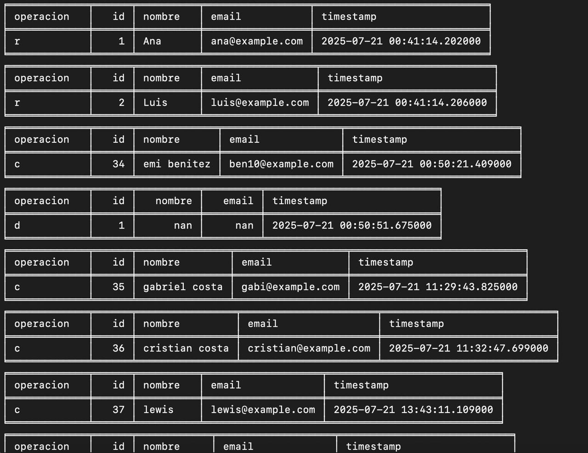
    *Proceso de Consumo de datos de la cola KAFKA*

  <br><br>

  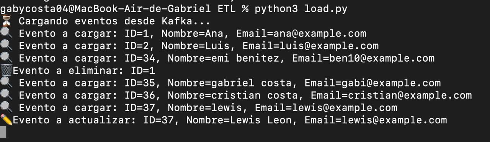
    *Proceso de Carga de datos en el CSV Final*
  <br><br>

- El proceso de ETL-Consumer, veras que carga los datos en un archivo intermedio llamado BUFFER.CSV, donde tendra la siguiente estructura:
  - operacion (operacion a realizar)
  - id
  - nombre
  - email
  - timestamp (tiempo en el que se realizo la operacion en el registro en el origen)
  
  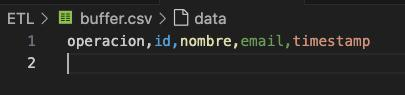<br>
  *No tiene datos, ya que al consumirlo el proceso LOAD, este queda vacio*
<br>

- El proceso de Load, veras que realiza la operacion correspondiente (Carga, Actualizacion o Eliminacion) en los datos en el archivo final llamado DESTINY.CSV, donde tendra la siguiente estructura:
  - id
  - nombre
  - email

  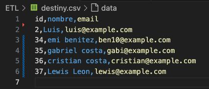


---

## 📌 Proximos pasos

- Con todo este procedimiento se logro el objetivo inicial, donde traemos los cambios capturados de los datos en tiempo real de la BD Origen PSQL, hasta el destino (en nuestro caso un simple CSV).

- Pero esto nos sirve si siempre tenemos desplegado los procesos corriendo y que cuando levantemos los servicios, la base destino este siempre vacia (ya que cuando levantamos todo el proceso, nos traemos todos los cambios historicos que vienen del origen)

- Ante esto surge las siguientes casuisticas a trabajar a futuro:
  - Como traigo datos desde una cierta fecha solamente sin traerme toda la historia
  - Como traigo datos desde el ultimo registro que exportamos al destino y asi no generar inconsistencias
  - Como podria registrar cuando se apago el servicio de PSQL y Kafka para saber desde cuando tengo que traer registros una vez que ambos se vuelvan a levantar para mantener el destino consistente.
  - Como podria enviar datos a otro almacenamiento de datos que no sea un simple CSV